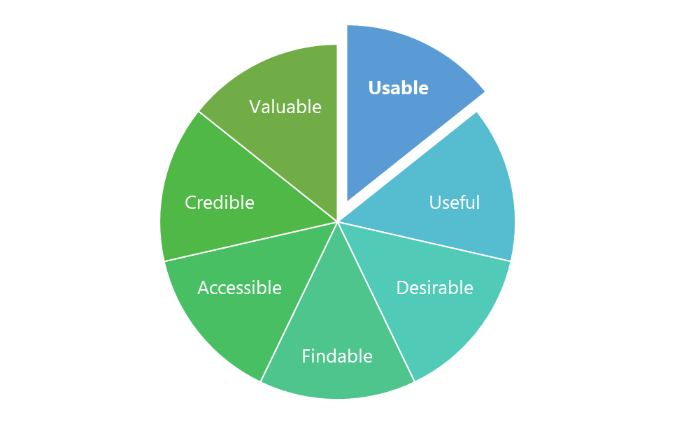

.. role:: cite

.. role:: citein

.. raw:: latex

    \providecommand*\DUrolecite[1]{\citep{#1}}
    \providecommand*\DUrolecitein[1]{\citet{#1}}

===============
1. Introduction
===============

1.1. Context
============

The discovery of new materials and components has been crucial for the
development of the humankind through all their history. Some examples are the
copper, steel or ceramics whose use has allowed the improvement of the life
quality. But it was not until the 19\ :superscript:`th` century when we learnt
the importance of the physical-chemical properties of the new materials for
supplying our lifestyle. 

Since then until nowadays, the need of create new materials has grown up, and
with it, the development of analytic synthesis for that purpose. The first one
was from 1828, when Friedrich Wöhler produced urea with potassiumcyanate and
ammoniumsulfate (:cite:`Leicester1951`).

This necessity has increased exponentially during the last century in several
fields, such as electrical engineering, biology or medicine. The latter, the
importance lies on the development of new and better drugs; a milestone
especially relevant in the increase of life expectancy.

The search for new drugs has accompanied humanity for the whole its existence.
Initially, the remedies were obtained mainly with the discovery of natural
components with healing properties, but it was in the mid-nineteenth century
when scientist began to isolate and purify the active principles. The next
progress in drug discovery was during the last century when pharmacologists, for
designing new remedies, applied random chemical substitutions to a known
structural drug or used combinatorial chemistry techniques, such as
fragment-based design (:cite:`Kedzierska2018`).

However, with all these techniques we haven’t found a great number of new
medicines and there is still a necessity of create new ones; specially with the
current growing concern of drug-resistant diseases. There is, therefore, an
obligation of searching and employing different and more successful strategies.

The current solution for searching new medicines is the **rational design**,
which is based on the identification of suitable targets in the body and
designing the structure to interact with that target (:cite:`Kedzierska2018`).
This rational designing is depending on the studies of molecular interactions at
low levels, and in order to achieve this it has been used the assistance of the
**informatics**.

The use of computational resources in the organic chemistry and drug industry is
not something new. Since the 1960s graphics hardware and prototypical software
were have been used in the drug design (:cite:`Meyer2000`) and the Dendral
Project of Stanford University in the 1960s made the use of this resource very
promising. However, until the late 1990s the use of computers was too limited
because computers could only deal with very simple molecules which humans did
not need much assistance (:cite:`Feng2018`). But nowadays, computers can
generate molecular models that can be a great assistant in the design and
generation of new drugs.

1.2.  Molecular modelling
=========================

The definition of molecular modelling by *Giovanni* and *Ramiro* from the
Santander Industrial University is the development and application of physical
and chemical theories in the description of a phenomenon whose model,
exclusively solved by computer, predicts the behaviour of the phenomenon
(:cite:`MoralesMedina2009`).

It is about the translation of the 3D coordinates of the structure of the
molecule into an energy value and these calculations needed cannot be performed
without a computer because their complexity. The model with the **lowest
energy** value will be the most probably conformation of the molecule
(:cite:`Barbault2015`).

There are three ways for describing molecular systems:

- *Ab initio* Quantum Mechanics. 
- Semi-empirical Quantum Mechanics.
- Molecular Mechanics.

Each of these three ways provides us different accuracies on the modelling
simulation and they have divergent needs.

1. *Ab initio* Quantum Mechanics.

This technique uses the Quantum Mechanics (QM) to obtain the energy of the
atomic coordinates by resolving the Schrödinger equation through a Hamiltonian
(Ĥ) independent-time function. Both nucleus and electrons are treated explicitly
and are described by wave functions.

.. math:: Ĥψn(r)=Enψn(r)

However, the exact solution is limited to one-electron molecules and for other
systems we need approximations (:cite:`Barbault2015`). These approximations
require a great computational power, and not every molecular system can be
modelled. 

2. Semi-empirical Quantum Mechanics.

One way to avoid the problem of the extensive computational demanding and use
the QM in larger systems is to treat the electronic Hamiltonian (H\
:subscript:`ele`) more easily for solve approximately the Schrodinger equation.
In this way we can obtain more accuracy in the systems than with Molecular
Mechanics, but with less computational demanding than QM
(:cite:`MoralesMedina2009`).

3. Molecular mechanics. 

Lastly, we have the classical Molecular Mechanics (MM) for describing the
molecular system, by doing big approximations and using classical or Newtonian
mechanics. This descriptor does not consider the nucleus and electrons as
independent entities like the two previous, but consider the whole atom (both
nucleus and electrons) as a unique entity. To define this atom entity in a
particular atom it is necessary to have previously empirical parameters. The
bonds of the atoms are represented via harmonic forces). 

The potential energy of the system is calculated using force fields, a set of
functions that are the sum of the bonded (bonds, angles, impropers, dihedrals)
and non-bonded terms (electrostatic and Van der Waals) (:cite:`Vanommeslaeghe2014`).

The molecular model obtained is the lowest accurate, but is also the lowest
computational demanding. It is used in big molecular systems like **biological
molecule** with thousands of atoms. 

|

Another way to improve the accuracy of the model without the computing demands
limitations of the QM is to work with hybrid systems QM/MM in which the great
part of the system structure is modelled with MM and the main part, for example,
the active site of an enzyme, where it is important to have more information is
modelled with QM.

The generation of molecular models for drug design can contribute in different
aspects like decreasing the cost and designing time and even improving already
existent medicines. But as we have said before, the design of new biomolecules
from already known structures, it has not allowed us to explore the great
diversity in biomolecule structures which would provide us completely
innovative drugs.

In order to achieve it, we need first to design new biological structure systems
from a starting situation of lacking data. 

1.3. Computer-assisted molecular design (CAMD)
==============================================

In this situation, for the creation of new biomolecules, we need to consider
three main aspects:

- Certain physicochemical rules to guarantee that the new molecule can exist.
- The existence of different types of interactions in various situations:

  - Covalent Bonds.
  - Coordination.
  - Non-bonding interactions (Van der Waals, dispersive forces, hydrogen bonds and polar interactions).
- The chemobiological space.

This last one aspect refers to the fact that the system of a new biomolecule
must be a hybrid system that merges chemical compounds and biological moieties
in a functional entity. This space takes into account the conformational,
chemical and biological axis:

(Image of chemobiological space)

The conformational axis refers to all the possible geometric operations that a
set of atoms can experiment: translation, rotation, torsion, rocking and
bouncing. This is responsible of the stability of the structure.

The chemical axis, for its part, refers to the addition of atoms in a molecules
or specific substitution of its functional groups.

And lastly, the biological axis, is responsible of the biological aspect of the
structure like mutations or active regions.

There are several strategies for molecular design at the moment like Monte
Carlo-like algorithms (MC) (:cite:`Das2008`), or evolutionary algorithms (EA),
specifically genetical algorithms (GA). These strategies are used by commercial
docking programs such as GOLD (:cite:`Jones1997`) or AutoDock
(:cite:`Trott2010`), among others.

These applications can work in a very efficient way, but they only work in
specific situations. For general cases in conditions where there is an absence
of initial data, a better tool would be **GAUDImm**, designed by *Jaime
Rodríguez Guerra*.

1.4. Genetic Algorithms with Unrestricted Descriptors for Intuitive Molecular Modelling (GAUDImm)
================================================================================================

1.4.1. Description
------------------

GAUDImm (Genetic Algorithms with Unrestricted Descriptors for Intuitive
Molecular Modelling) is a modular platform for rapid 3D sketching of molecular
systems. It combines a Multi-Objective Genetic Algorithm (MOGA), the NGSA-II
multi objective GA, with diverse molecular descriptors to overcome the
difficulty of generating candidate models for systems with scarce structural
data. Its grounds consist in transforming any molecular descriptor (i.e. those
generally used for analysis of data) as a guiding objective for PES explorations
(:cite:`Rodriguez-GuerraPedregal2017`).

With this MOGA, the program can optimize all the needed variables (objectives)
at the same time; and this is a key aspect in the CAMD of new biomolecules.
NGSA-II generates randomly an initial population of possible solutions
(individuals) and is evaluated with several objectives, each one with a fitness
value. Then, the best solutions are selected to recombine or mutate among the
precedent individuals and the new solutions generated and the best ones will be
selected to the next generation. This process is repeated several times and, in
the end, we will have a final pool of the best solutions generated.

(Image of NGSA-II)

GAUDImm is based on Python 2 and the NGSA-II used is applied by the Python
module DEAP. It works with an initial YAML file where all the variables
responsible of the GAUDImm's job are defined. These variables are classified in
5 types:

1.	Genes variables: they define the molecule system.
2.	Objectives variables: they specify the evaluation of the solutions.
3.	Genetic Algorithm variables: they describe the behaviour of the GA depends on these variables. Usually only the number of total generations and the number of individuals per population are modified. 
4.	Output variables: they define the characteristics of the output of the job.
5.	Similarity variables: they define how the program will distinguish between equal solutions.

The solutions are generated by Chimera, the main molecular framework in which
GAUDImm works. The 3D drawing of the solution can be reproduced inside Chimera
and interactively with the interface GaudiView (:cite:`Rodriguez-Guerra2017`)
for exploring and analysing. 

GAUDImm can generate accurate solutions comparing to other programs of molecular
modelling, depending on the variables selected in the creation of the YAML file,
especially in the genes and objectives. However, this program can be seen as a
first step in a molecular modelling process, to generate an initial set of
solution to later perfect them with Molecular Dynamics and QM/MM optimizations.

GAUDImm has been proved to work successfully in predicting systems of metal
coordination and metal-binding sites (:cite:`Sciortino2019`), covalent dockings
and other examples, like protein folding. Regarding normal dockings, although
GAUDImm has achieved good results, they are not as accurate as other programs
generate.

1.4.2. Limitations
------------------

As we have said before, the current version of GAUDImm has problems to solve
normal dockings, when other programs, like GOLD, can perform them without
problems. This is because GAUDImm spent a great part of the computing time on
removing very poor solutions or even solutions not possible in a real situation.
Meanwhile in GOLD, as is specialized in molecular dockings, there are certain
presumptions to prohibit a range of solutions and thus spent all the
computational power in searching the best solution. This is a negative
consequence of being a program for general uses.

Furthermore, the current version is a reference implementation and it is not
thought to be as efficient as possible. GAUDImm only uses a core during the
whole execution, and as a consequence, the running time is extremely large. 

The main project of this master thesis is about the **optimization of the
performance of GAUDImm**, implementing a parallelized version to decrease the
execution time. 

1.5. Challenges of the Bioinformatics tools
===========================================

This limitation of the performance is not unique of GAUDImm, but also is present
in other Bioinformatics tools. The advancements in technologies have brought
about the ability of generate big data and model complex structures with lower
hardware costs. However, the computational demands have growth exponentially and
to overcome these system limitations, the use of High-Performance Computing
(HPC), like high-throughput and **parallel-processing** techniques, are becoming
more popular (:cite:`Al-Ali2016`). One of the most utilized is the efficient use
of multi-core systems.

Other issue concerned in Bioinformatics tools is the User Experience (UX). The
UX is the set of elements or factors of a program that interacts with the user
generating a good or bad feeling about the program which will cause the user to
reuse it or not.

We can identify seven main factors in the UX (:cite:`PeterMorville2019`):

1. Useful. 
2. Usable.
3. Desirable.
4. Findable.
5. Accessible.
6. Credible.
7. Valuable.

Some bioinformatics tools with a poor UX can act like a big barrier to scientist
with great experience in biology field but with little informatics experience.
This is a common issue in these tools because they usually are created with an
oriented development approach rather than user-centred design approach
(:cite:`Kurosu2013`).

The progress on technology has allowed to use complex software for
bioinformatics problems in our local machines and obtain a great amount of data
in a faster and cheaper way. This situation opens the door to non-bioinformatics
scientists to use these bioinformatics tools. However, frustrating and
time-consuming software can result in a less productive research and the
improvement in any of the factors involving the UX can not only ease the use of
these tools but also develop an appropriate learning curve.

Taking into account these challenges in bioinformatics tools, apart from the
optimization in the GAUDImm's performance, in this thesis we wanted to improve
the UX of GAUDImm, focusing on the usable factor of a whole GAUDImm job:

    Figure 3. Diagram of the elements of the UX by *Peter Morville* emphasizing
    the usable factor.

If we want GAUDImm to be widely used, we need to ease the use by improve certain
steps in a GAUDImm process job, especially in the first steps of creating the
input file and analysing the output.

.. bibliography:: bibliography.bib