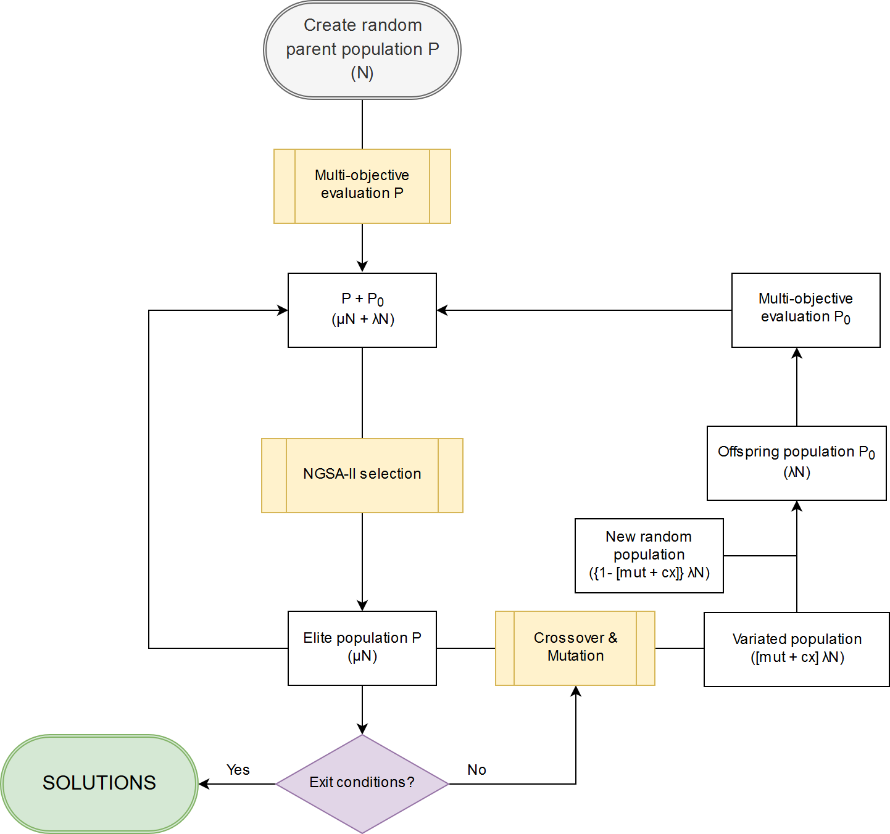

===============
1. Introduction
===============

1.1. Context
============

The discovery of new materials and components has been crucial for the development of the humankind throughout history. Some examples are copper, steel or ceramics whose use has allowed the improvement of life quality. But it was not until the 19\ :superscript:`th` century when we learnt the importance of the physical-chemical properties of the new materials for supplying our lifestyle.

Since then, the need to create new materials has grown, and with it, the development of analytic synthesis for that purpose. The first one was from 1828, when *Friedrich Wöhler* produced urea with *Potassium cyanate* and *Ammonium sulphate* (Leicester & Klickstein, 1951). This synthesis of new materials has increased exponentially during the last century in several fields, such as electrical engineering, biology or medicine. For the latter, the importance lies on the development of **new and better drugs**; a milestone especially relevant in life expectancy.

The search for new drugs has accompanied humanity during its whole existence. Initially, the remedies were obtained mainly thanks to the discovery of natural components with healing properties, but it was in the mid-nineteenth century when scientists began to isolate and purify active principles. The next progress in drug discovery was during the last century when pharmacologists, for designing new remedies, applied random chemical substitutions to a known structural drug or used combinatorial chemistry techniques, such as fragment-based design (Kedzierska et al., 2018). In essence, the attempt to create new drugs from already known structures.

However, with all these techniques it has not been enough for finding a great number of new medicines and there is still a necessity of create new ones; specially with the current growing concern of drug-resistant diseases. There is, therefore, an obligation of searching and employing different and more successful strategies.

The current solution for searching new medicines is the **rational design**, which is based on the identification of suitable targets in the body and designing the proper structure to interact with such target (Kedzierska et al., 2018). This rational designing depends on the studies of molecular interactions at low levels, and in order to achieve this the assistance of **informatics** has been used.

The use of computational resources in the organic chemistry and drug industry is not new. Since the 1960s, graphics hardware and prototypical software have been used in drug design (Meyer, Swanson, & Williams, 2000) and the Dendral Project of Stanford University in the 1960s made very promising its use. However, until the late 1990s the use of computers was too limited because they could only deal with very simple molecules for which humans did not need much assistance (Feng, Lai, & Pei, 2018). But nowadays, computers can generate **molecular models** that can be of great help for the design and generation of new drugs.

1.2.  Molecular modelling
=========================

The definition of molecular modelling by *Giovanni* and *Ramiro* from the Santander Industrial University is: “the development and application of physical and chemical theories in the description of a phenomenon whose model, exclusively solved by computers, predicts the behaviour of the phenomenon” (Morales Medina & Rey, 2009).

It is about the translation of the 3D coordinates of the molecule structure into an energy value and the calculations needed cannot be performed without a computer due to their complexity. The model with the **lowest energy** value will be the most probable conformation of the molecule (Barbault & Maurel, 2015).

There are four main ways for describing molecular systems:

- *Ab initio* Quantum Mechanics. 
- Semi-empirical Quantum Mechanics.
- Molecular Mechanics.
- Coarse grain models.

Each of these four ways provides with different accuracies on the modelling simulation and they have divergent needs.

1. *Ab initio* Quantum Mechanics.

This technique uses the Quantum Mechanics (QM) to obtain the energy of the atomic coordinates by resolving the Schrödinger equation through a Hamiltonian (Ĥ) independent-time function (1). Both nucleus and electrons are treated explicitly and described by wave functions.

.. math:: Ĥψn(r)=Enψn(r) (1)

However, the exact solution is limited to one-electron molecules and for other systems we need approximations (Barbault & Maurel, 2015). These approximations require a great **computational power**, and not every molecular system can be modelled.

2. Semi-empirical Quantum Mechanics.

One way to avoid the problem of the extensive and demanding computational calculation and the use of QM in larger systems is to solve approximately the Schrodinger equation by simplifying the electronic Hamiltonian (H\
:subscript:`ele`). In this way we can obtain higher accuracy in the systems than with Molecular Mechanics, but with less computational demanding than QM (Morales Medina & Rey, 2009).

3. Molecular mechanics. 

Leaving QM apart, the classical Molecular Mechanics (MM) is available for describing molecular systems, by doing big approximations and using classical or Newtonian mechanics. This descriptor does not consider the nucleus and electrons as independent entities like the two method above mentioned. Instead, the whole atom (both nucleus and electrons) is considered as a unique entity. To define these entities in a particular atom it is necessary to have previous **empirical parameters**. The bonds of the atoms are represented via harmonic forces.

The potential energy of the system is calculated using force fields, a set of functions that are the sum of the bonded (bonds, angles, impropers, dihedrals) and non-bonded terms (electrostatic and Van der Waals) (Vanommeslaeghe, Guvench, & MacKerell, 2014).

The molecular model obtained is less computational demanding than the two previously showed, but as a consequence, it is also less accurate. It is used in big molecular systems like **biological molecules** with thousands of atoms.

4. Coarse grain models.

Lastly, we have the Coarse Grain models (CG models), the less accurate approximation, but also the less computationally expensive. In these models, entities are not applied for the representation of neither the nucleus, electrons nor atoms itself, but sites or superatoms that correspond to groups of atoms. The process of transforming a detailed structured into a CG representation is called CG mapping, and a part of the information, considered unimportant, is eliminated (Noid, 2013).

The CG systems have “sites” associated with a particular atom group, with a particular physicochemical type and they are united with GC bonds. This process of mapping reduces drastically the computational demanding, but a great accuracy is lost.

|

Another way to improve the accuracy of the model without the computing demands limitations of the QM is to work with hybrid systems QM/MM in which the great part of the system structure is modelled with MM and the main part is modelled with QM, for example, the active site of an enzyme, where it is important to have more accurate information.

All these techniques for molecular modelling can be used in the same modelling process, each one, in a different step. In this process, in order to predict the macroscopic behaviour of a system, we start from the quantum scale (finer and small) and we pass the information obtained into molecular scales and eventually to process scales (coarser and larger), by leaving out degrees of freedom (Praprotnik & Site, 2013). This methodology is called **multiscale molecular modelling** and it is a powerful tool for modelling biological systems.

The generation of molecular models for drug design can contribute in different aspects like decreasing the cost and designing time and even improving already existent medicines. But as we have said before, the design of new biomolecules from already known structures, it has not allowed the complete exploration of the great diversity in biomolecule structures which would provide us completely innovative drugs.

In order to achieve it, we need first to design new biological structure systems from a starting situation of lacking data.

1.3. Computer-assisted molecular design (CAMD)
==============================================

In this situation, for the creation of new biomolecules, we need to consider three main aspects:

- Certain physicochemical rules to guarantee that the new molecule can exist.
- The existence of different types of interactions in various situations:

  - Covalent Bonds.
  - Coordination.
  - Non-bonding interactions (Van der Waals, dispersive forces, hydrogen bonds and polar interactions).
- The chemobiological space.

This last one aspect refers to the fact that the system of a new biomolecule must be a hybrid system that merges chemical compounds and biological moieties in a functional entity. This space takes into account the conformational, chemical and biological axes:

The **conformational axis** refers to all the possible geometric operations that a set of atoms can experiment: translation, rotation, torsion, rocking and bouncing. This is responsible of the stability of the structure. The **chemical axis**, for its part, refers to the addition of atoms in a molecule or specific substitution of its functional groups. And lastly, the **biological axis** explains residue mutations, and travelling all along the sequence of the species, mainly in its active regions. For example, how a mutation in a given residue can disturb the structure of an alpha-helix.

There are several strategies for molecular design at the moment like Monte Carlo-like algorithms (MC) (Das & Baker, 2008), or evolutionary algorithms (EA), specifically genetic algorithms (GA). These strategies are used by commercial docking programs such as GOLD (Jones, Willett, Glen, Leach, & Taylor, 1997) or AutoDock (Trott & Olson, 2010), among others.

These applications can work in a very efficient way, but they only work in specific situations. For general cases the implementation of EA for multi-objective optimization has been a widely used option because they do not require any derivative information, they are relatively simple to use and they are flexible in its applicability (Deb, 2001). The possibility of optimizing systems by multi-objectives evaluations allows us to design new molecules in absence of initial data. However, GA are by nature computationally expensive, and with the multi-objective traits the computation cost increases exponentially. The **GaudiMM** program, designed by *Jaime Rodríguez Guerra*, is a promising program which uses a GA for multi-objective optimization that could be useful for creating new biomolecules.

1.4. Genetic Algorithms with Unrestricted Descriptors for Intuitive Molecular Modelling (GAUDImm)
================================================================================================

1.4.1. Description
------------------

GaudiMM (Genetic Algorithms with Unrestricted Descriptors for Intuitive Molecular Modelling) is a modular platform for rapid 3D sketching of molecular systems. It combines a Multi-Objective Genetic Algorithm (MOGA), the NGSA-II multi objective GA, with diverse molecular descriptors to overcome the difficulty of generating candidate models for systems with scarce structural data. Its grounds consist in transforming any molecular descriptor (i.e., those generally used for analysis of data) as a guiding objective for PES explorations (Rodríguez-Guerra Pedregal, Sciortino, Guasp, Municoy, & Maréchal, 2017).

With this MOGA, the program can optimize all the needed variables (objectives) at the same time; and this is a key aspect in the CAMD of new biomolecules. NGSA-II generates randomly an initial population of possible solutions (individuals) which are evaluated with several objectives, each one with a fitness value. Then, the best solutions are selected to recombine or mutate to generate a new offspring population, which is also evaluated. The best individuals of the precedent population and the offspring are selected to the next generation (Figure 1). To guarantee a diverse pool of solutions, GaudiMM compares the structures to obtain the RMSD and, together with a threshold specified by the user, it determines if they are similar or not. In those cases that the RMSD value surpasses the threshold, the structure would be removed. This process is repeated several times and, at the end, a final pool with the best solutions generated is returned.

GaudiMM is based on Python 2 and the NGSA-II used is applied by the Python module DEAP. It works with an initial YAML file where all the variables responsible of the GaudiMM's job are defined. These variables are classified in 5 types:

1.	**Genes variables**: they define the molecule system.
2.	**Objectives variables**: they specify the evaluation of the solutions.
3.	**Genetic Algorithm variables**: they describe the behaviour of the GA. Usually only the number of total generations and the number of individuals per population are modified.
4.	**Output variables**: they define the characteristics of the output.
5.	**Similarity variables**: they specify how the program will distinguish between very similar solutions.

    **Figure 1**. Flowchart of the NGSA-II used by GaudiMM. **N** is the number of individuals in the initial population **P**; **μ** and **λ**, are, respectively, related to the number of individuals selected for the next generation and the number of children produced at each generation (offspring population **P0**); **mut** and **cx** are the probabilities associated to mutation and crossover (Rodríguez-Guerra Pedregal et al., 2017).

The solutions are generated by Chimera, the main molecular framework in which GaudiMM works. The 3D drawing of the solution can be reproduced inside Chimera and interactively with the interface GaudiView (Rodríguez-Guerra, 2017) for exploring and analysing.

GaudiMM can generate accurate solutions when compared to other programs of molecular modelling, depending on the variables selected in the creation of the YAML file, especially in the genes and objectives. However, this program can be seen as a first step in a molecular modelling process, to generate an initial set of solutions to later refine them with Molecular Dynamics and QM/MM optimizations.

The fact of considering the geometric explorers (genes) and the quality evaluators (objectives) allows the exploration and evaluation of several variables in highly diverse fields of research. GaudiMM has been proved to work successfully in predicting systems of metal coordination and metal-binding sites (Sciortino, Garribba, Rodríguez-Guerra Pedregal, & Maréchal, 2019), covalent dockings and other examples, like protein folding. Regarding normal dockings, although GaudiMM has achieved good results (45.45 % success for a threshold of 2.5 Å), they are not as accurate as the ones that other programs generate, like GOLD (69.7 % for a threshold of 2 Å) (Rodríguez-Guerra Pedregal et al., 2017).

1.4.2. Limitations
------------------

As said before, the current version of GaudiMM has problems to solve normal dockings, when other programs, like GOLD, can perform them without problems. This is because GaudiMM spend a great part of the computing time on removing very poor solutions or even solutions not possible in a real situation, at the same time that take into account the solutions’ quality. Meanwhile in GOLD, as it is specialized in molecular dockings, there are certain presumptions to prohibit a range of structures and thus spend all the computational power in searching the best solution. This is a negative consequence of being a program for general uses.

Furthermore, the current version is a reference implementation and it is not thought to be as efficient as possible. GaudiMM only uses a unique core during the whole execution, and as a consequence, the running time is extremely large. This problem has repercussions in the applicability for processes in which they demand numerous calculations, such as virtual screening. This drawback impediments us to perform a parametrization for improving GaudiMM’s procedure, and hinders its use in a cluster where a unique core is discouraged.

Therefore, the main aim of this Master’s Thesis is the **optimization of the performance of GaudiMM**, implementing a parallelized version to decrease its execution time.

1.5. Challenges of the Bioinformatics tools
===========================================

The limitation of the performance is not unique of GaudiMM, but also is present in other Bioinformatics tools. The advancements in technologies have brought about the ability of generating big data and model complex structures with lower hardware costs. However, the computational demands have grown exponentially and to overcome these system limitations, the use of High-Performance Computing (HPC), like high-throughput and **parallel-processing** techniques, are becoming more popular (Al-Ali, Kathiresan, Anbari, Schendel, & Zaid, 2016). One of the most utilized is the efficient use of multi-core systems.

Other issue concerned in Bioinformatics tools is the User Experience (UX). The UX is the set of elements or factors of a program that interacts with the user generating a good or bad feeling about the program which will cause the user to reuse it or not.

We can identify seven main factors in the UX (Peter Morville, 2019) (Figure 2):

.. figure:: fig/ux_pie.png
    :alt: Pie representing all the elements conforming the UX.
    :align: center

    **Figure 2**. Diagram of the elements of the UX by *Peter Morville* emphasizing the usable factor.

Some bioinformatics tools with a poor UX can represent a big barrier to scientists with great experience in biology field but with limited informatics knowledge. This is a common issue in these tools because they are usually created with an oriented development approach rather than user-centred design approach (Kurosu, 2013).

The progress on technology has allowed to use complex software for bioinformatics problems in our local machines and obtain a great amount of data in a faster and cheaper way. This situation opens the door to non-bioinformatics scientists to bioinformatics tools. However, frustrating and time-consuming software can result in a less productive research and the improvement in any of the factors involving the UX can not only ease the use of these tools but also develop an appropriate learning curve.

Taking into account these challenges in bioinformatics tools, apart from the optimization in the GaudiMM's performance, in this thesis the aim was at the improvement of the **UX of GaudiMM**, focusing on the usable factor of a whole GaudiMM job.

If GaudiMM is desired to be widely used, its use has to be eased by improving certain steps in a GaudiMM process job, especially in the first steps of creating the input file and analysing the output.
