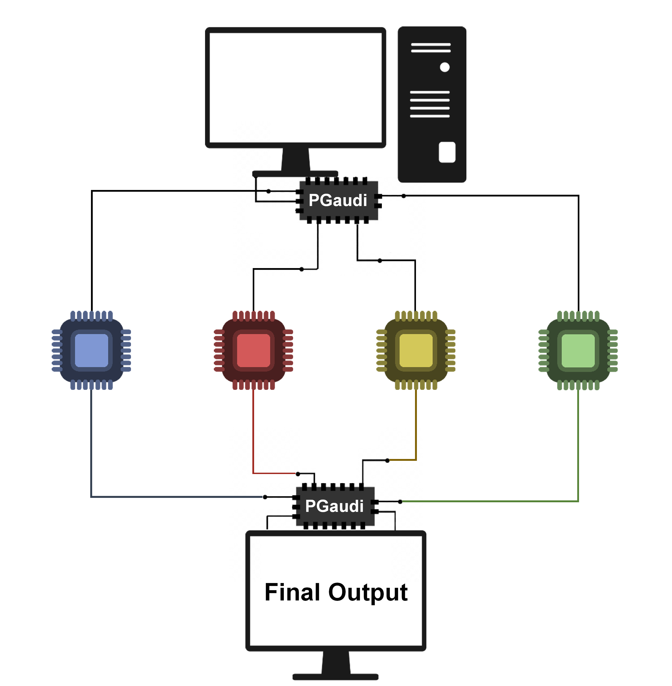

=========
3. PGaudi
=========

3.1. Parallel computing
=======================

As we have seen previously GAUDImm has potential to be optimised in its
performace. Nowadays, almost all computers have multicore processors but GAUDImm
uses only one core to execute a job, so we thouhgt in a parallel computing
approach for the peformance optimization. 

Parallel computing has been on stage since the 1970s but it has not been until
now that the efforts to achieve efficient parallel computing have been relevant.
This is due to the limitation in increasing the clock speed owing to the heat
dissipation increase proportionally or more, and to maintain the same chip area
the interest in parallel tecnhiques has growth. (A Review of Parallelization Tools and Introduction to Easypar)

3.2. *Internal* parallelization vs *external* parallelization
=============================================================

The main question to answer was which approach to parallelization choose.
GAUDImm spent the most part of the executing evaluating the solutions with the
NGSA-II algorithm, so we though in using the multiprocessing option for DEAP,
the Python module which apply the MOGA of GAUDImm, for which we would need to
change the GAUDImm code. This is was the *internal* parallelization approach.

(DEAP in Intro)

But we also thouhgt in another way of implementation, an *external*
parallelization, consisting of a code that manually divides the main GAUDImm
process in subprocesses for then gathers the solutions and generates an unique
output.

Initially the internal parallelization seemed smoother, cleaner and more
optimise, however it wasn't easy to implement. DEAP uses the ``multiprocessing``
module for the generation of subprocesses to carry out the parallel computing.
To achieve this aim, it is necessary to perform a seriallization process in
which the process, with all its Python object hierarchy, is converted into a
byte stream. Thus, the subprocess can managed by the ``multiprocessing`` module,
and they can sending information between them. 

The problem is that the *pickling* process of ``multiprocessing`` is led by the
``pickle`` module that has limitations on what can be pickled. The classes are
pickle by “fully qualified” name reference, not by value, and as a consequence,
none of the class’s code or data is pickled. This problem is visible when
applying the *internal* parallelization in GAUDImm with a ``PicklingError``
exception, at the time of *pickling* the solutions. The obvious way to solve the
problem is to rewrite the code in order to make the classes importable. However,
GAUDImm solutions are build over Chimera classes, which rely in the core
development of Chimera, which is written in C++. This would be a big problem
and could extent the development a great deal.

Therefore, the development of an *external* code responsible of generating and
handling the subprocesses of GAUDImm, above the code, seemed more plausible.

3.3. Methodology of the parallelization
=======================================

After selecting the development approach of the code another main question
arose: **How do we parallelize a GA in the most efficient way?** There are
several ways of GA parallelization, with different approximations. There were
mainly two issue to decide: cross-over/isolation behaviour and the subprocesses
simplification. 

The interaction, or absence of it, between the subprocesses can impact on the
output of the GA. The sharing of information between the different subprocesses
running a GA could be very positive; they might share their best solution every
X generations. However, as we have seen in the previous section, this procedure
would be hindered because of the *pickling*. Hence, we decide to use an
isolation tecnique, in which the subprocesses were totally independent.

This isolation can help the main GAUDImm process the find the best solutions.
The fact that every subprocess is an independent GA, means that every subprocess
begin with a unique initial population and will have an unequaled evolutionary
process. As a consequence, the whole GAUDImm job will explore more solutions and
will generate a very diverse pool of solutions ensuring an output of quality.

However, the creation of new subprocesses from a main one, can increase the
computational demands if those new subprocesses are computationally equal, and
we wouldn't talk of parallelization, but replication of the main process. For
that reason, PGaudi generates new simpler subprocesses.

Considering all these aspects, PGaudi is responsible of scan the initial input
and its variables and generates new input files and executes parallel ``gaudi
run`` process of them. These files have smaller values for the main two
variables of the GA: the number of total generations and the number of
individuals per population, to simplify the computation. The simplification is
proportional to the number of subprocesses generated. 

Once all the subprocesses finished and the final output pool of solutions is
generated PGaudi collects them all in a unique pool and checks for double
solutions. The parallel GA can converge in the same solutions in certain
situations, in which case, PGaudi removes one of the repeated solutions. 

At the end of the whole process, PGaudi gathered the remaining solutions in a
unique output file and merge all the log files in the output directory.

3.4. Coding PGaudi
==================

3.4.1. Creation of files for parallelization
--------------------------------------------

.. code-block:: console

    READ input_file.yaml 
        SAVE data of input_file.yaml
        IF simplify processes
            THEN simplify GA variables
        WRITE data in new files

PGaudi uses the ``yaml`` code for reading the YAML input file and save the data
in a Python dicitionary object. If the user doesn't specify to not use the
simplification of the subprocesses, the data variable is modified to decerase
the values of the variables of the GA previously commented. Then, using the same
module write as many files as subprocesses will generate. 

3.4.2. Generation of the subprocesses
-------------------------------------

.. code-block:: console

    FOR file in new files (PARALLEL)
        EXECUTE a Gaudi run process of the file
    FOREND

For the execution of the parallel computing PGaudi uses the ``multiprocessing``
module and creates a ``multiprocessing.Pool`` which is an abstraction to handle
the subprocess. The ``Pool`` is executed by the function
``multiprocessing.Pool.map_async`` which recieves a function, the execution
``gaudi run``, and iterable, the list of names of the new files. 

3.4.3. Removing of double solutions
-----------------------------------

.. code-block:: console

    SAVE all possible combinations of outputs pair

    FOR combination in combinations (PARALLEL)
        FOR pair of solutions in combination
            IF equal solutions
                THEN EXECUTE remove one solution randomly
        FOREND
    FOREND

    SAVE the new modified populations of solutions

The removing of the double solutions runs in a parallel way too. Firstly, it
saves all the possible combinations between all the outputs generated after the
completation of the subprocesses. Then, compare the 3D structure of one solution
to another solution's structure from another population.

The solutions from a same population are not compare because they are already
different.

3.4.4. Gathering of the solutions and output files
--------------------------------------------------

.. code-block:: console

    FOR population in population
        EXECUTE merge population
    FOREND
    WRITE a unique output file with the total population

    FOR log-file in log-files generated
        EXECUTE merge log-file in a unqiue log-file output
    FOREND

The creation of the two output files doesn't have much mystery. PGaudi merges
all the solutions in a unique population and uses a similar function to the
original GAUDImm function to create the output file ``.gaudi-output``, which
uses the ``yaml`` module. For that, PGaudi saves all the solutions, with other
information in a Python dicitionary obejct. 

For creating the unique ``.gaudi-log`` file, PGaudi merge with a simple function
using basic methos for read and write files. 

    :alt: Diagram of PGaudi's operation
    :align: center
    :scale: 75%

    Diagram of the main idea of PGaudi's performance

3.5. Usage
==========

PGaudi is designed to be usable and therefore its simplicity. After its
`installation <https://pgaudi.readthedocs.io/en/latest/installation.html>`_ the
program is executed via the terminal with the command ``pgaudi``:

.. code-block:: console

    $ pgaudi path/to/some_file.gaudi-input

After this command a proces of PGaudi and its subprocesses will be generated.
However, here are also some options that the user can specify:

3.5.1. Subprocesses generated
-----------------------------

By default, PGaudi automatically detects the number of cores in the machine and
sets this value as the number of subprocess generated. However, the user can
specify the number of subprocesses in which the main process is divided with the
option ``-p <PROCESSES>``.

This is useful for using PGaudi in a cluster and if the user doesn't want to use
all cores of the local machine.

3.5.2. Simplification of subprocesses
-------------------------------------

Automatically, PGaudi set this option in False to generate computationally
simpler subprocesses. The user can change this behaviour with the option ``-e,
--equal`` and PGaudi will generate replicates of the main GAUDImm process. 

3.5.3. Summary
--------------

List with all options:

  -p <PROCESSES>  Number of processes in which the main process is divided.
                  [Default = cores in the machine]
  -e, --equal     Set the new subprocesses generated computationally equal to
                  the main process. [Default = False]
  -h, --help      Show the help message and exit.
  -v, --version   Show program's version number and exit.

Usage:

.. code-block:: console

    $ pgaudi path/to/some_file.gaudi-input [-p int_number_of_subprocess] [-e] [-h] [-v]

-----

Further information
-------------------

For more reading of PGaudi, see the official documentation at:
https://pgaudi.readthedocs.io/.

The source code is available in GitHub at:
https://github.com/andresginera/pgaudi and in the Appendix section.

The API documentation is as wll in the Appendix section.