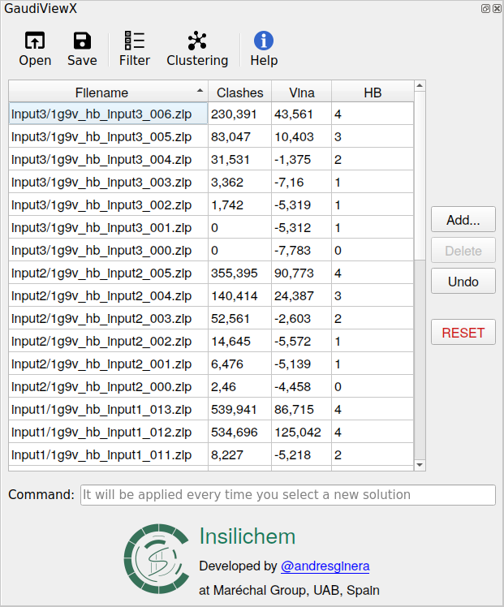
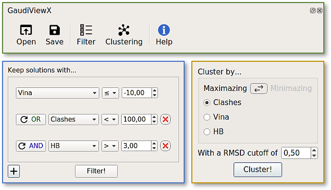

============
4 GaudiViewX
============

4.1. ChimeraX and Python3
=========================

Python 2 will not be maintained past 2020, in six months since this Thesis will be delivered (Peterson, 2019) and many Python projects developers have made their intention to drop Python 2 support in or before 2020 (O’Brien, 2019). For that reason, our purpose was to initiate a migration process of the Insilichem projects to Python 3.

It was decided to start with the light interface of GaudiView that uses Chimera to display the 3D drawing of the GaudiMM solutions' structure. The adaptation of the program to the newer version of the framework ChimeraX was desirable, as it has several advantages relative to Chimera like a high-performance manipulation and rendering of large numbers of atoms, and a system of **ChimeraX bundles** for easy installation and updates, with dependencies handled correctly, among others benefits.

UCSF ChimeraX is the next-generation molecular visualization program from the Resource for Biocomputing, Visualization, and Informatics (RBVI). It is implemented in Python 3, instead of Python 2 like the previous version of Chimera, with chunks of C++ thrown in for performance (Goddard et al., 2018). ChimeraX is designed to be extensible, like the browsers and its extensions. These ChimeraX extensions are called bundles and are installed directly inside ChimeraX with all the needed dependencies.

The creation of a bundle for ChimeraX of an upgraded version of GaudiView was then our objective, but based on Python 3: **GaudiViewX**, with more functionalities.

4.2. Methodology of GaudiViewX
==============================

The graphical interface of GaudiViewX (Figure 12) uses PyQt5 instead of the ``tkinter`` module, due to the integration by default of PyQt5 from ChimeraX. PyQt5 is a set of Python bindings for v5 of the Qt application framework from The Qt Company. Qt is a set of C++ libraries and development tools that includes platform independent abstractions for graphical user interfaces, networking, threads, regular expressions, etc (The Qt Company, 2019). PyQt5 lets to build easily graphical interface compatible with different platforms: Linux, Windows and OS X.

The functionalities of GaudiView were desirable in the new version: basic file handling, filtering and clustering. But also, it was interesting to add more utilities like the ability of editing the output file. In order to make a more intuitional interface, the utilities were grouped in a main toolbar, a more recognizable trait for the user.

    
    **Figure 12.** General visualization of GaudiViewX for Linux platform.

4.3. Usage
==========

Thanks to the bundle system of ChimeraX the installation of GaudiViewX is simpler than GaudiView, as ChimeraX is responsible of the dependencies. Once the graphical interface is installed, its use is quite clear. The interface has three main elements:

1. The table with the solutions.
2. A toolbar.
3. A command line.

4.3.1. Table solutions
----------------------

After opening GaudiViewX and loading a file, the table with the solutions will appear in the ChimeraX window. Selecting any solution of the table will display its 3D structure in the framework.

This table can be **edited** with the buttons that accompany the table.:

* **Adding** new solutions from a different file as long as it has the same objectives.
* **Deleting** the solutions selected.

With the other two buttons the user can return to a previous state of the table. The user can undo until five actions and the button Reset will restore all the table to the original ones from the first file loaded.

4.3.2. Toolbar
--------------

There are five utilities in the toolbar (Figure 13):

1. **Open**. Opens a dialog window to load a new output file closing all the models of a previous output file loaded.
2. **Save**. Opens a dialog window to save the current data loaded in the table in the same file or in a new one.
3. **Filter**. Lets the user to filter the solution of interest specifying the objective(s), the logic behaviour (>, <, =, ≥, ≤, ≠) and threshold of the filter.
4. **Clustering**. Allows the user to cluster the solutions selecting:

 * The **objective** for which you want to do the clustering.
 * The behavior **maximazing** or **minimazing** this objective.
 * The **threshold of the RMSD**, which will determine if two solutions are considered equal or different.

5. **Help**. Displays the internal help window.

    
    **Figure 13.** ▶ Toolbar graphical interface with its utilities. ▶ Multi-filter dialog windows interface. Initially only one condition is showed and the user can select the objective, but the user can add more with the plus bottom in the bottom-left corner. These conditions can be preceded by AND/OR, modifying the behaviour of the whole filtering condition. In the case showed, after the filtering the solutions kept will be those with a vina score equal or less than -10,00 and those with clashes less than 100,00 and more than 3 hydrogens bonds. ▶ Clustering dialog interface. The images are retrieved from the Linux version.

4.3.3. Command Line
-------------------

GaudiViewX has also incorporated a command line, that has the advantage with respect to the ChimeraX command line of being executed each time the user selects a new solution to facilitate the view, exploration and analysis of the GaudiMM solutions.
